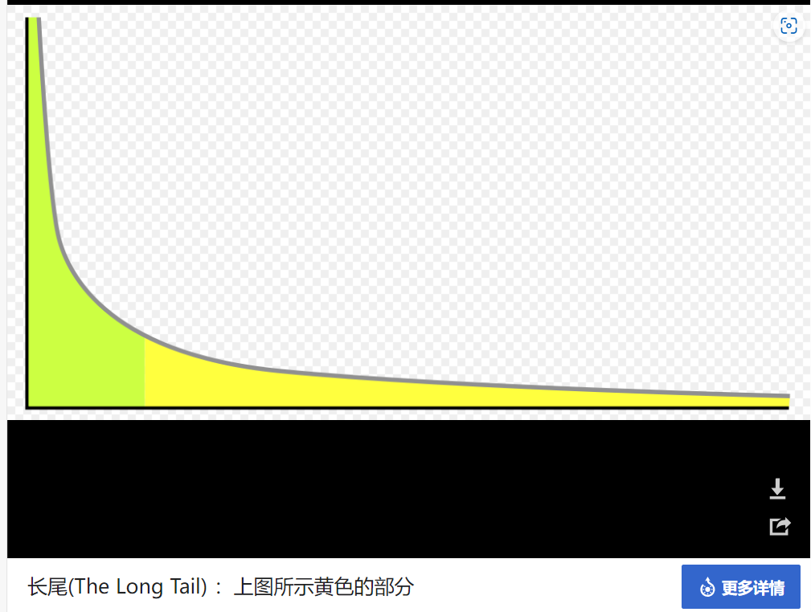

# 研究点一

## 测试是否是代码有误

### baseline

找了一个开源的原始代码：用如下的模型在MNIST数据集上进行联邦平均，然后查看运行结果，训练轮数50轮

```python
class Net(nn.Module):
    def __init__(self):
        super(Net, self).__init__()
       # convolutional layer (sees 28x28x1 image tensor)
        self.conv1 = nn.Conv2d(1, 4, 3, padding=1)
        # convolutional layer (sees 14x14x4 tensor after MaxPool)
        self.conv2 = nn.Conv2d(4, 16, 3, padding=1)
        # max pooling layer
        self.pool = nn.MaxPool2d(2, 2)
        # linear layer (7 * 7 * 16)
        self.fc1 = nn.Linear(7 * 7 * 16, 512)
        # linear layer (512 -> 10)
        self.fc2 = nn.Linear(512, 10)
        # dropout layer (p=0.20)
        self.dropout = nn.Dropout(0.20)
        
    def forward(self, x):
        # add sequence of convolutional and max pooling layers
        x = self.pool(F.relu(self.conv1(x)))
        x = self.pool(F.relu(self.conv2(x)))
        # flatten image input
        x = x.view(-1, 7 * 7 * 16)
        # add dropout layer
        x = self.dropout(x)
        # add 1st hidden layer, with relu activation function
        x = F.relu(self.fc1(x))
        # add dropout layer
        x = self.dropout(x)
        # add 2nd hidden layer, with relu activation function
        x = self.fc2(x)
        # LogSoftMax
        return F.log_softmax(x, dim=1)
```

运行结果如下所示


### my-models

#### LeNet

运行文件[fl_CIFAR100_LeNet](https://github.com/lao1a0/Iov-with-FL/blob/main/12-15组会/fl_CIFAR100_LeNet.ipynb)，数据集是CIFAR100，模型是[ID LG ](https://colab.research.google.com/drive/1K6P2FD9XimFo5AeU0Iws4FOtZkkgzPy7)攻击的目标模型。因为这个模型用的数据集也是`CIFAR-100`，所以先看一下在联邦学习中模型精度如何，运行结果如下：`jupyter nbconvert --to html --execute fl_CIFAR100_LeNet.ipynb`


这里test_loss朝着负数方向增大是因为使用的是负对数损失`F.nll_loss`

```python
def test(model, device, federated_test_loader, batch_size): 
    model.eval()
    test_loss = 0
    correct = 0
    with torch.no_grad():
        for data, target in federated_test_loader:
            model.send(data.location) # <-- NEW: send the model in virtual workers to Trusted Aggregator
            data, target = data.to(device), target.to(device)
            output = model(data)
            loss = F.nll_loss(output, target, reduction='sum')
            model.get()
            test_loss += loss.get() # sum up batch loss
            pred = output.argmax(1, keepdim=True) # get the index of the max log-probability 
            correct += pred.eq(target.view_as(pred)).sum().get()

    test_loss /= len(federated_test_loader)

    print('\nTest set: Average loss: {:.4f}, Accuracy: {}/{} ({:.0f}%)\n'.format(
        test_loss, correct, len(federated_test_loader) * batch_size,
        100. * correct / len(federated_test_loader) / batch_size))
```

> [负对数自然损失的取值范围是负无穷到零。当预测的概率等于真实的类别的概率时，损失为零；当预测的概率越远离真实的类别的概率时，损失越大，趋向于负无穷](https://www.zhihu.com/question/300066479)
>
> [负对数似然损失（Negative Log Likelihood Loss）是一种常用的损失函数，通常用于分类任务中。它是针对输入的每个样本计算损失，是对分类问题中输出结果的一种概率分布表示。具体来说，对于每个样本，它预测的是一个类别的概率分布，并以该分布的对数似然值作为该样本的损失。换句话说，负对数似然损失计算的是预测的概率与真实的类别的对数似然值的负数。](https://zhuanlan.zhihu.com/p/659288660)
>
> [负对数似然损失的目的是让预测的概率越接近真实的类别的概率，从而减小损失。它可以看作是最大似然估计的一种负对数形式，最大似然估计的本质思想是找到一个模型参数，使得模型产生观察到的数据的概率最大。](https://zhuanlan.zhihu.com/p/35709139)
>
> [负对数似然损失可以用于二分类或多分类问题，不同的是，二分类问题通常使用Sigmoid函数作为激活函数，多分类问题通常使用Softmax函数作为激活函数。](https://www.zhihu.com/question/582175900?write)


二次实验结果，设定惩罚函数都一样


方向是对了，但是50轮了，识别精度都很低


## 复现Fed+cifar的算法

### FedSAM

[debcaldarola/fedsam](https://github.com/debcaldarola/fedsam?utm_source=catalyzex.com)、[Improving Generalization in Federated Learning by Seeking Flat Minima | Papers With Code ](https://paperswithcode.com/paper/improving-generalization-in-federated)

> FedSAM是一种联邦学习算法，用于解决在联邦学习中数据分布不平衡的问题。基于Sharpness Aware Minimization（SAM）本地优化器。FedSAM的第一个模块是直接先验分析器（DPA），用于==估计全局数据的长尾统计信息==，而不需要暴露客户端的私有数据。FedSAM的第二个模块是自适应梯度平衡器（SGB），用于在每个客户端进行局部训练时，根据DPA得到的全局长尾特征，对正负梯度进行类别级别的重新加权。SGB采用了一个基于比例-积分-微分控制器的闭环和自适应机制，不断调整梯度的加权系数，使得每个类别的累积正负梯度之差趋于一个预定的平衡目标。FedSAM在多个长尾分类的基准数据集上进行了广泛的实验，包括CIFAR-10-LT, CIFAR-100-LT, ImageNet-LT和iNaturalist。实验结果表明，FedSAM在不同的不平衡和异构数据设置下，都能超越现有的联邦优化和长尾学习的方法，特别是在尾部类别上取得了显著的性能提升](https://arxiv.org/abs/2206.02618)[1](https://arxiv.org/abs/2206.02618)[2](https://arxiv.org/pdf/2206.02618.pdf).
>

> [长尾分布](https://so.csdn.net/so/search?q=长尾分布&spm=1001.2101.3001.7020)，指的是一小部分标签（即头部标签）有很多数据实例，而大多数标签（即尾部标签）只有很少数据实例的不平衡分类情况。
> 例如：在[自动驾驶](https://so.csdn.net/so/search?q=自动驾驶&spm=1001.2101.3001.7020)数据集中，汽车类别的数据非常多，但是锥桶的类别非常少。
>
> **长尾**（英语：The Long Tail），或译**长尾效应**，是指那些原来不受到重视的销量小但种类多的产品或服务由于总量巨大，累积起来的总收益超过主流产品的现象。
>
> 
