# 研究点一

## 测试是否是代码有误

### BaseLine-MNIST

找了一个开源的原始代码：用如下的模型在MNIST数据集上进行联邦平均，然后查看运行结果，训练轮数50轮

```python
class Net(nn.Module):
    def __init__(self):
        super(Net, self).__init__()
       # convolutional layer (sees 28x28x1 image tensor)
        self.conv1 = nn.Conv2d(1, 4, 3, padding=1)
        # convolutional layer (sees 14x14x4 tensor after MaxPool)
        self.conv2 = nn.Conv2d(4, 16, 3, padding=1)
        # max pooling layer
        self.pool = nn.MaxPool2d(2, 2)
        # linear layer (7 * 7 * 16)
        self.fc1 = nn.Linear(7 * 7 * 16, 512)
        # linear layer (512 -> 10)
        self.fc2 = nn.Linear(512, 10)
        # dropout layer (p=0.20)
        self.dropout = nn.Dropout(0.20)
        
    def forward(self, x):
        # add sequence of convolutional and max pooling layers
        x = self.pool(F.relu(self.conv1(x)))
        x = self.pool(F.relu(self.conv2(x)))
        # flatten image input
        x = x.view(-1, 7 * 7 * 16)
        # add dropout layer
        x = self.dropout(x)
        # add 1st hidden layer, with relu activation function
        x = F.relu(self.fc1(x))
        # add dropout layer
        x = self.dropout(x)
        # add 2nd hidden layer, with relu activation function
        x = self.fc2(x)
        # LogSoftMax
        return F.log_softmax(x, dim=1)
```

运行结果如下所示

<center>
    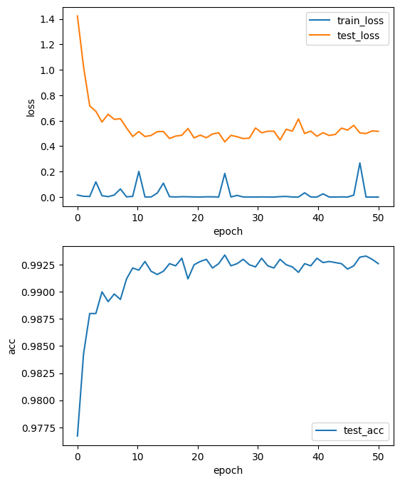<br/>
	<div style="color:orange; border-bottom: 1px solid #d9d9d9;
    display: inline-block;
    color: #999;
    padding: 5px;">
  	</div>
</center>

### LeNet-CIFAR100

运行文件[fl_CIFAR100_LeNet](https://github.com/lao1a0/Iov-with-FL/blob/main/12-15组会/fl_CIFAR100_LeNet.ipynb)，模型是[ID LG ](https://colab.research.google.com/drive/1K6P2FD9XimFo5AeU0Iws4FOtZkkgzPy7)攻击的目标模型。因为这个模型用的数据集也是`CIFAR-100`，所以先看一下在联邦学习中模型精度如何，运行结果如下：`jupyter nbconvert --to html --execute fl_CIFAR100_LeNet.ipynb`

<center>
    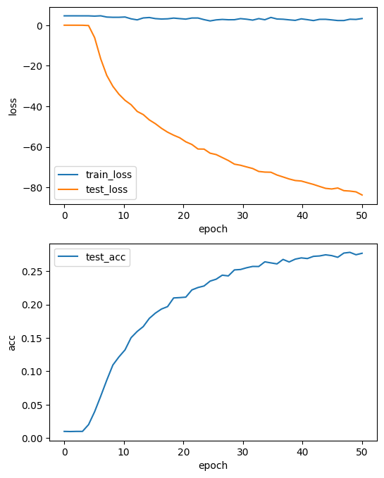<br/>
	<div style="color:orange; border-bottom: 1px solid #d9d9d9;
    display: inline-block;
    color: #999;
    padding: 5px;">
  	</div>
</center>

这里test_loss朝着负数方向增大是因为使用的是负对数损失`F.nll_loss`

```python
def test(model, device, federated_test_loader, batch_size): 
    model.eval()
    test_loss = 0
    correct = 0
    with torch.no_grad():
        for data, target in federated_test_loader:
            model.send(data.location) # <-- NEW: send the model in virtual workers to Trusted Aggregator
            data, target = data.to(device), target.to(device)
            output = model(data)
            loss = F.nll_loss(output, target, reduction='sum')
            model.get()
            test_loss += loss.get() # sum up batch loss
            pred = output.argmax(1, keepdim=True) # get the index of the max log-probability 
            correct += pred.eq(target.view_as(pred)).sum().get()

    test_loss /= len(federated_test_loader)

    print('\nTest set: Average loss: {:.4f}, Accuracy: {}/{} ({:.0f}%)\n'.format(
        test_loss, correct, len(federated_test_loader) * batch_size,
        100. * correct / len(federated_test_loader) / batch_size))
```

> [负对数自然损失的取值范围是负无穷到零。当预测的概率等于真实的类别的概率时，损失为零；当预测的概率越远离真实的类别的概率时，损失越大，趋向于负无穷](https://www.zhihu.com/question/300066479)
>
> [负对数似然损失（Negative Log Likelihood Loss）是一种常用的损失函数，通常用于分类任务中。它是针对输入的每个样本计算损失，是对分类问题中输出结果的一种概率分布表示。具体来说，对于每个样本，它预测的是一个类别的概率分布，并以该分布的对数似然值作为该样本的损失。换句话说，负对数似然损失计算的是预测的概率与真实的类别的对数似然值的负数。](https://zhuanlan.zhihu.com/p/659288660)
>
> [负对数似然损失的目的是让预测的概率越接近真实的类别的概率，从而减小损失。它可以看作是最大似然估计的一种负对数形式，最大似然估计的本质思想是找到一个模型参数，使得模型产生观察到的数据的概率最大。](https://zhuanlan.zhihu.com/p/35709139)
>
> [负对数似然损失可以用于二分类或多分类问题，不同的是，二分类问题通常使用Sigmoid函数作为激活函数，多分类问题通常使用Softmax函数作为激活函数。](https://www.zhihu.com/question/582175900?write)

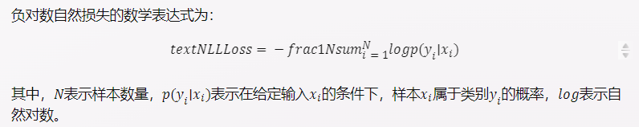

二次实验结果，设定惩罚函数都一样

<center>
    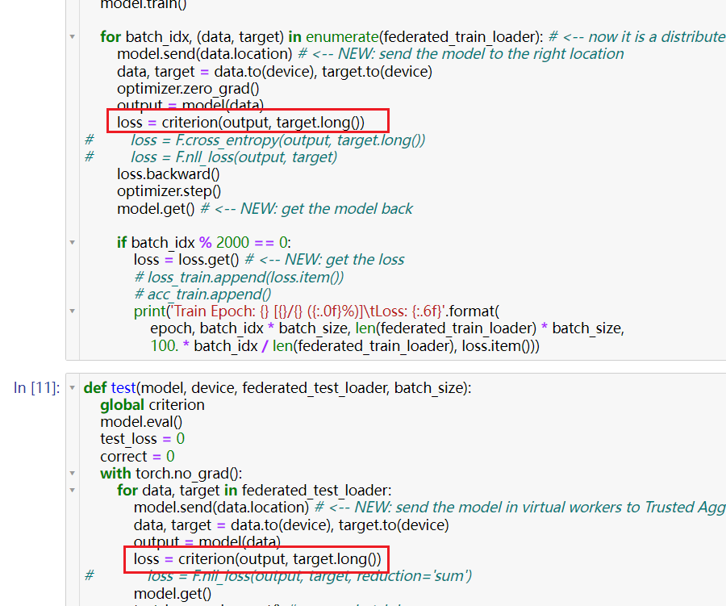<br/>
	<div style="color:orange; border-bottom: 1px solid #d9d9d9;
    display: inline-block;
    color: #999;
    padding: 5px;">
  	</div>
</center>

方向是对了，但是50轮了，识别精度都很低

<center>
    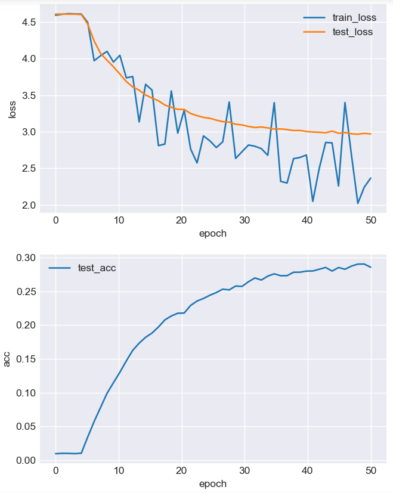<br/>
	<div style="color:orange; border-bottom: 1px solid #d9d9d9;
    display: inline-block;
    color: #999;
    padding: 5px;">
  	</div>
</center>

考虑是不是fl的原因。不用fl直接训练，结果如下，证明确实是模型不行

<center>
    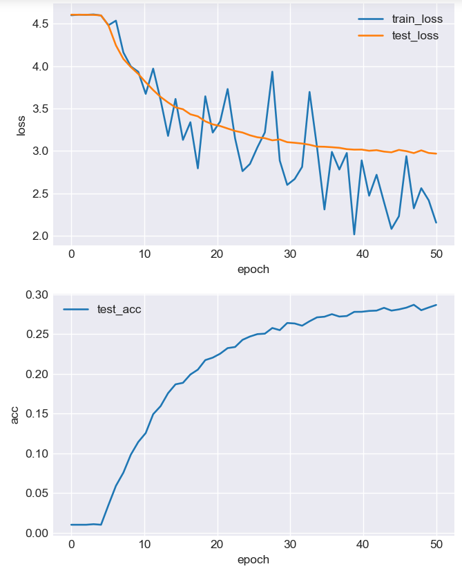<br/>
	<div style="color:orange; border-bottom: 1px solid #d9d9d9;
    display: inline-block;
    color: #999;
    padding: 5px;">不使用FL直接进行分类
  	</div>
</center>

在[CIFAR-100 Benchmark (Image Classification) | Papers With Code](https://paperswithcode.com/sota/image-classification-on-cifar-100)中寻找基准模型，选择的是Percentage correct 96%的`effnet-l2`

<center>
    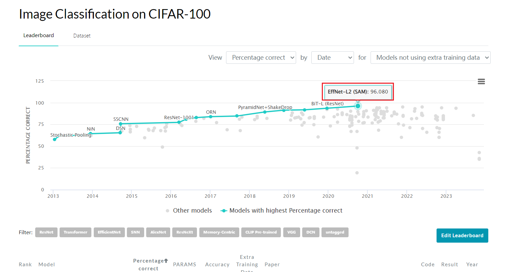<br/>
	<div style="color:orange; border-bottom: 1px solid #d9d9d9;
    display: inline-block;
    color: #999;
    padding: 5px;">不使用FL直接进行分类
  	</div>
</center>

> 在机器学习中，Percentage correct和Accuracy都是用于评估分类模型性能的指标之一。Accuracy代表模型预测正确的样本数与总样本数之比。Percentage correct代表模型预测正确的样本数与总样本数之比。两者的区别在于，Accuracy是在二元分类问题中使用的指标，而Percentage correct可以用于多类分类问题。如果您需要更多信息，请告诉我

### ResNet18-CIFAR100

以下是使用FL分类的结果：

<center>
    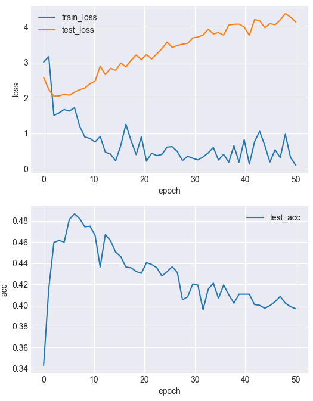<br/>
	<div style="color:orange; border-bottom: 1px solid #d9d9d9;
    display: inline-block;
    color: #999;
    padding: 5px;">不使用FL直接进行分类
  	</div>
</center>

> - **训练损失**：从4.63降低到0.10，表明模型在训练集上的拟合能力逐渐提高。
> - **测试损失**：从2.58升高到4.14，表明模型在测试集上的泛化能力不足，==出现了过拟合现象==。
> - **测试准确率**：从34%上升到40%，表明模型在测试集上的分类性能有所提升，但仍然不够理想。
>
> 综上所述，训练结果还有改进的空间，可以尝试以下方法来优化您的模型：
>
> - **调整学习率**：您的学习率设置为0.03，可能过大导致模型无法收敛到最优解，您可以尝试使用较小的学习率或者使用学习率衰减策略。
> - **增加数据增强**：您的数据增强只包含了ToTensor和Normalize，可能不足以提高模型的鲁棒性，您可以尝试使用更多的数据增强方法，如随机旋转，随机裁剪，随机翻转等。
> - **使用正则化**：您的模型没有使用任何正则化方法，可能导致模型过于复杂而过拟合，您可以尝试使用L2正则化，Dropout，BatchNorm等方法来防止过拟合。

以下是不使用FL直接进行分类的结果：

<center>
    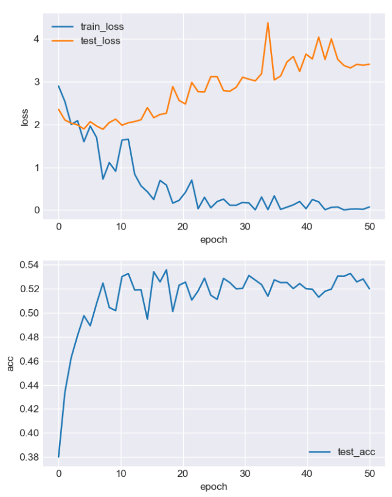<br/>
	<div style="color:orange; border-bottom: 1px solid #d9d9d9;
    display: inline-block;
    color: #999;
    padding: 5px;">不使用FL直接进行分类
  	</div>
</center>

> - 模型在训练集上的损失（loss）逐渐下降，但在测试集上的损失（loss）波动较大，甚至有上升的趋势。这说明模型可能存在**过拟合**（overfitting）的问题，即模型对训练数据过度拟合，而对测试数据的泛化能力不足。
>
> - 模型在测试集上的准确率（accuracy）在50%左右，相比于CIFAR-100的基准（benchmark）性能，还有较大的提升空间。目前，最好的模型在测试集上的准确率可以达到80%以上。
>
> - 需要对预训练模型的参数进行一些微调（fine-tuning），以适应新的数据集的特点。
>
>   - 使用一些**正则化**（regularization）的方法，来防止模型过拟合，例如**数据增强**（data augmentation）、**权重衰减**（weight decay）、**批归一化**（batch normalization）等。
>
>   - 使用一些**优化**（optimization）的方法，来提高模型的收敛速度和性能，例如**学习率调整**（learning rate scheduling）、**动量**（momentum）、**Adam**等。
>
>   - 尝试使用一些**更深**（deeper）或**更适合**（more suitable）的模型，来提高模型的表达能力和泛化能力，例如**ResNet-50**、**DenseNet**、**EfficientNet**等。


# 研究点二

## 验证是否是激活函数的原因

### ReLU

原来的模型不变，改变激活函数为`ReLU`，DLG攻击结果如下

<center>
    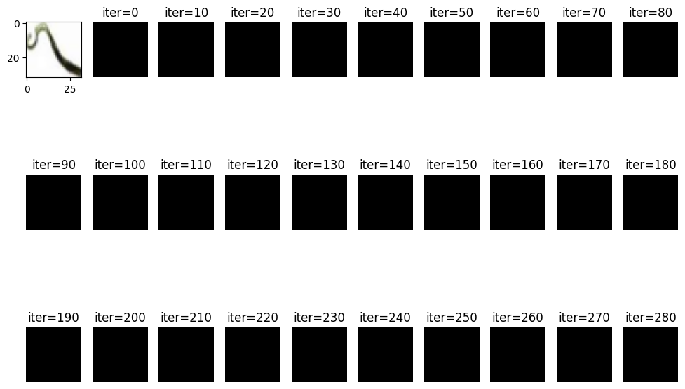<br/>
	<div style="color:orange; border-bottom: 1px solid #d9d9d9;
    display: inline-block;
    color: #999;
    padding: 5px;">DLG攻击
  	</div>
</center>
IDLG攻击的结果如下：

<center>
    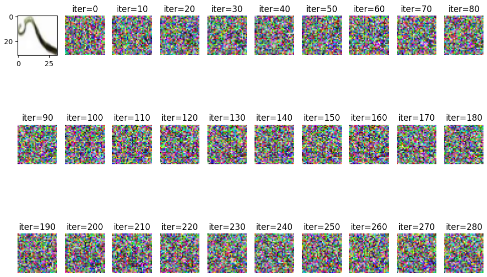<br/>
	<div style="color:orange; border-bottom: 1px solid #d9d9d9;
    display: inline-block;
    color: #999;
    padding: 5px;">iDLG攻击
  	</div>
</center>

具体的可以见这里：[Iov-with-FL/12-15组会/ID_LG_ReLU.ipynb at main · lao1a0/Iov-with-FL (github.com)](https://github.com/lao1a0/Iov-with-FL/blob/main/12-15组会/ID_LG_ReLU.ipynb)

### SoftMax

使用Softmax函数进行激活，DLG攻击结果如下：

<center>
    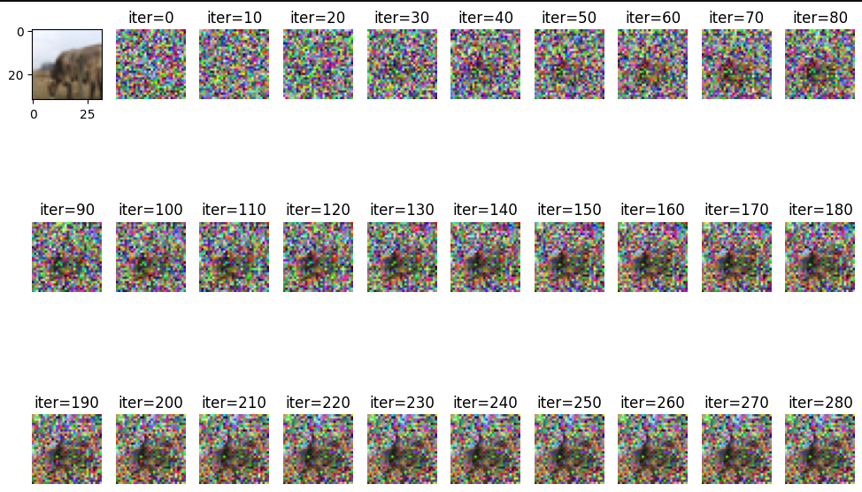<br/>
	<div style="color:orange; border-bottom: 1px solid #d9d9d9;
    display: inline-block;
    color: #999;
    padding: 5px;">iDLG攻击
  	</div>
</center>

iDLG攻击如下

<center>
    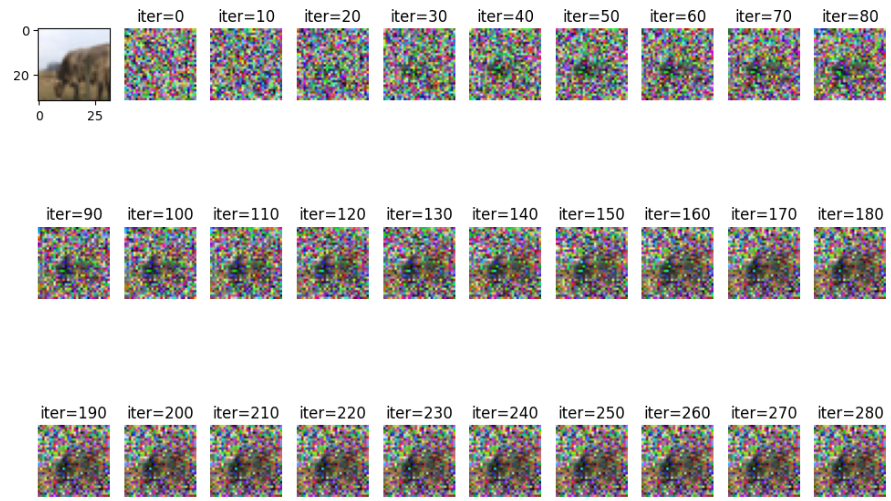<br/>
	<div style="color:orange; border-bottom: 1px solid #d9d9d9;
    display: inline-block;
    color: #999;
    padding: 5px;">iDLG攻击
  	</div>
</center>

### Tanh

<center>
    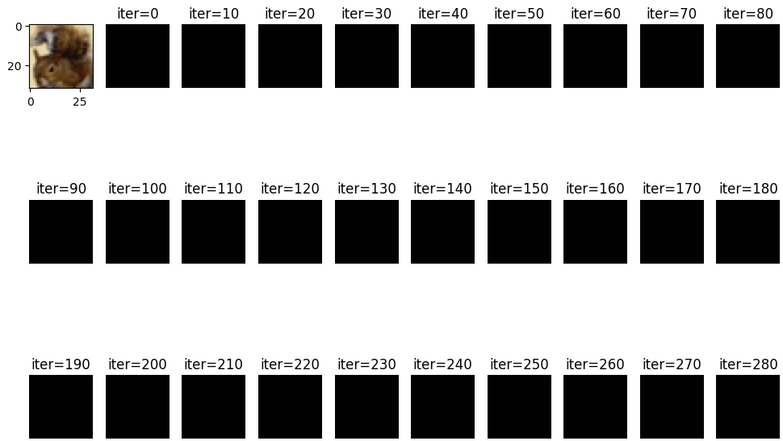<br/>
	<div style="color:orange; border-bottom: 1px solid #d9d9d9;
    display: inline-block;
    color: #999;
    padding: 5px;">iDLG攻击
  	</div>
</center>

<center>
    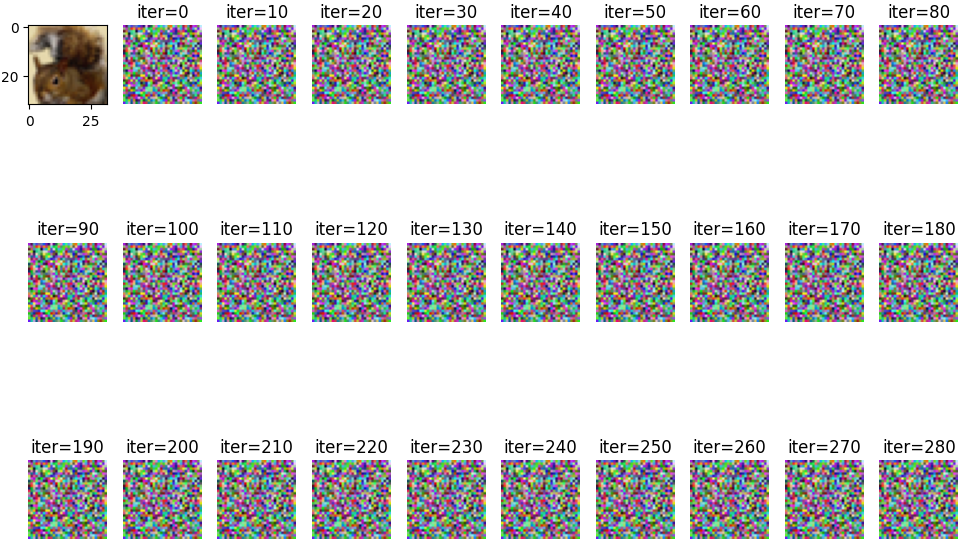<br/>
	<div style="color:orange; border-bottom: 1px solid #d9d9d9;
    display: inline-block;
    color: #999;
    padding: 5px;">iDLG攻击
  	</div>
</center>


# 复现Fed+cifar的算法

## FedSAM

[debcaldarola/fedsam](https://github.com/debcaldarola/fedsam?utm_source=catalyzex.com)、[Improving Generalization in Federated Learning by Seeking Flat Minima | Papers With Code ](https://paperswithcode.com/paper/improving-generalization-in-federated)

> FedSAM是一种联邦学习算法，用于解决在联邦学习中数据分布不平衡的问题。基于Sharpness Aware Minimization（SAM）本地优化器。FedSAM的第一个模块是直接先验分析器（DPA），用于==估计全局数据的长尾统计信息==，而不需要暴露客户端的私有数据。FedSAM的第二个模块是自适应梯度平衡器（SGB），用于在每个客户端进行局部训练时，根据DPA得到的全局长尾特征，对正负梯度进行类别级别的重新加权。SGB采用了一个基于比例-积分-微分控制器的闭环和自适应机制，不断调整梯度的加权系数，使得每个类别的累积正负梯度之差趋于一个预定的平衡目标。FedSAM在多个长尾分类的基准数据集上进行了广泛的实验，包括CIFAR-10-LT, CIFAR-100-LT, ImageNet-LT和iNaturalist。实验结果表明，FedSAM在不同的不平衡和异构数据设置下，都能超越现有的联邦优化和长尾学习的方法，特别是在尾部类别上取得了显著的性能提升waz
>

> [长尾分布](https://so.csdn.net/so/search?q=长尾分布&spm=1001.2101.3001.7020)，指的是一小部分标签（即头部标签）有很多数据实例，而大多数标签（即尾部标签）只有很少数据实例的不平衡分类情况。
> 例如：在[自动驾驶](https://so.csdn.net/so/search?q=自动驾驶&spm=1001.2101.3001.7020)数据集中，汽车类别的数据非常多，但是锥桶的类别非常少。
>
> **长尾**（英语：The Long Tail），或译**长尾效应**，是指那些原来不受到重视的销量小但种类多的产品或服务由于总量巨大，累积起来的总收益超过主流产品的现象。
>
> <center>
>          box-shadow: 0 2px 4px 0 rgba(34,36,38,.12),0 2px 10px 0 rgba(34,36,38,.08);" 
>     src="./img/image-20231210203955133.png" width = "55%" alt=""/><br/>
> 	<div style="color:orange; border-bottom: 1px solid #d9d9d9;
>     display: inline-block;
>     color: #999;
>     padding: 5px;">iDLG攻击
>   	</div>
> </center>
>
> 

### 安装过程：

```python
# curl http:\/\/10.10.43.3\/drcom\/login\?callback=dr1558050177253\&DDDDD=22125303\&upass=Xrq@9686\&0MKKey=123456\&R1=0\&R3=0\&R6=0\&para=00\&v6ip=\&\_=1558050050455

conda env create -f environment.yml # conda remov -n [] --all
# 创建数据集
conda activate torch10 && cd data
chmod +x setup_datasets.sh && ./setup_datasets.sh
# 运行实验环境
cd paper_experiments
chmod +x cifar10.sh && ./cifar10.sh

```

