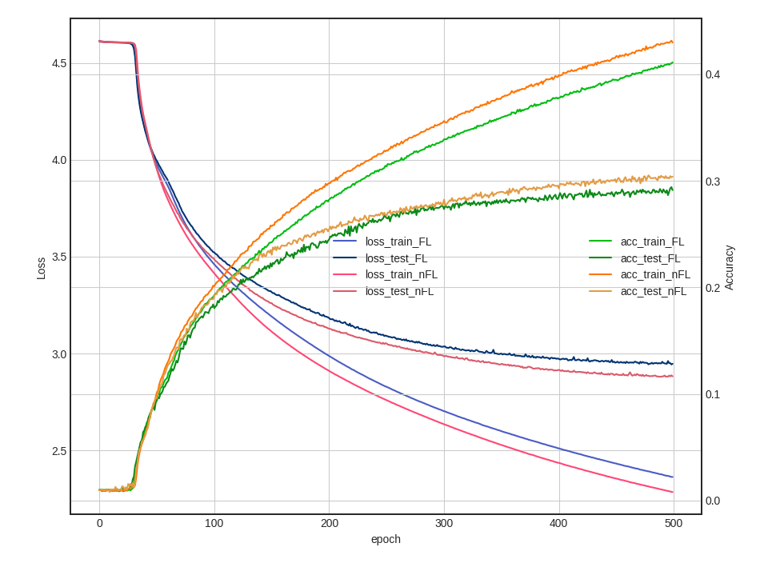
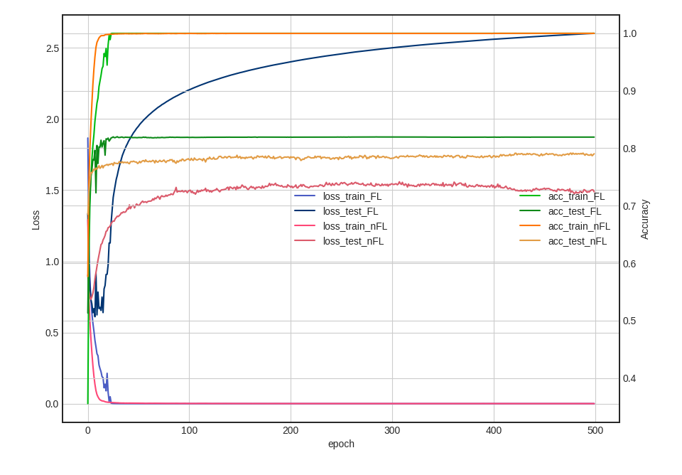

# 工作安排

- [ ] 看完[[2104.07586\] See through Gradients: Image Batch Recovery via GradInversion (arxiv.org)](https://ar5iv.labs.arxiv.org/html/2104.07586?_immersive_translate_auto_translate=1)这篇论文
- [ ] 复现[[2104.07586\] See through Gradients: Image Batch Recovery via GradInversion (arxiv.org)](https://ar5iv.labs.arxiv.org/html/2104.07586?_immersive_translate_auto_translate=1)
- [x] 复现[LiYangHart/Intrusion-Detection-System-Using-CNN-and-Transfer-Learning: Code for intrusion detection system development using CNN models and transfer learning (github.com)](https://github.com/LiYangHart/Intrusion-Detection-System-Using-CNN-and-Transfer-Learning)
- [ ] 复现[invertinggradients/environment.yml at master · JonasGeiping/invertinggradients (github.com)](https://github.com/JonasGeiping/invertinggradients/blob/master/environment.yml)
- [ ] 看完[Dreaming to Distill: Data-free Knowledge Transfer via DeepInversion](https://blog.csdn.net/FengF2017/article/details/115698179)
- [ ] 复现[NVlabs/DeepInversion](https://github.com/NVlabs/DeepInversion/tree/master)
- [x] 在Cifar-10上重新做一次实验

# 配置

 ```python
 nohup "jupyter nbconvert --to html --execute fl_CIFAR100_LeNet.ipynb"  > jp.log 2>&1 &
 
 HrtGzAWte9t&mFw#fD #MoB的密码
 
 pip install tensorflow -i https://pypi.tuna.tsinghua.edu.cn/simple
 pip install tensorboardX -i https://pypi.tuna.tsinghua.edu.cn/simple
 
 jupyter notebook --NotebookApp.iopub_msg_rate_limit=2000
 jupyter notebook --NotebookApp.rate_limit_window=5.0
 
 '''
 (breaching) zhaojia-raoxy@tsz-server-TITIAN:~/breaching$ df -h .
 Filesystem      Size  Used Avail Use% Mounted on
 /dev/nvme0n1p2  916G  652G  218G  75% /
 (breaching) zhaojia-raoxy@tsz-server-TITIAN:~/breaching$
 '''
 
 import torch
 
 # 查看系统中的 GPU 数量
 num_gpus = torch.cuda.device_count()
 print(f"Number of available GPUs: {num_gpus}")
 
 # 遍历每块 GPU，输出 GPU 的索引和剩余内存
 for gpu_idx in range(num_gpus):
     gpu_info = torch.cuda.get_device_properties(gpu_idx)
     gpu_name = gpu_info.name
     gpu_memory = torch.cuda.get_device_properties(gpu_idx).total_memory - torch.cuda.memory_allocated(gpu_idx)
     
     print(f"GPU {gpu_idx}: {gpu_name}")
     print(f"  Total Memory: {gpu_info.total_memory / (1024 ** 3):.2f} GB")
     print(f"  Used Memory: {(gpu_info.total_memory - gpu_memory) / (1024 ** 3):.2f} GB")
     print(f"  Free Memory: {gpu_memory / (1024 ** 3):.2f} GB\n")
 ```


# cifar-10 实验

> 重新修改了一下代码，进行500轮的训练。

- LeNet加了联邦学习与不加的效果都是差不多，在测试集上能够达到65%左右的准确率（[noFL 64%](https://github.com/lao1a0/Iov-with-FL/blob/main/12-22组会/LeNet_CIFAR10_fl_no.ipynb);[FL 63%](https://github.com/lao1a0/Iov-with-FL/blob/main/12-22组会/LeNet_CIFAR10_fl.ipynb)）


>  用了联邦学习后，在测试集上的准确率会比不用的稍微高一点（右侧第二对）土黄色后期深绿色的高。
>
> 用了联邦学习后，在测试集上的损失值会比不用的稍微高一点（右侧第三队）深蓝色后期比洋红色高。
>
> 轮收敛速度的话，联邦学习会比不用的快（loss ，蓝色是用了联邦平均的 ； acc 绿色是用了联邦平均的）

重新做了一下CIFAR100的实验，发现效果依旧挺差的



- ResNet18会产生过拟合的现象，能够达到80%左右的准确率（）



# 复现[LiYangHart](https://github.com/LiYangHart/Intrusion-Detection-System-Using-CNN-and-Transfer-Learning)

使用100%的数据量，复现一下原始的论文，并将keras的代码改成torch实现

- [2-CNN_Model_Development&Hyperparameter Optimization - Jupyter Notebook](http://127.0.0.1:8889/notebooks/Intrusion-Detection-System-Using-CNN-and-Transfer-Learning/2-CNN_Model_Development%26Hyperparameter Optimization.ipynb#Model-2:-Xception-torch)：正在跑的实验，在car-hacking100%数据集上跑原论文中的代码
- [CNN_CarHacking_nfl - Jupyter Notebook](http://127.0.0.1:8889/notebooks/CNN_CarHacking_nfl.ipynb)：在yeo-car-hacking100%数据集上进行原论文中CNN模型实验
  - 结果非常垃圾
- [CNN_CarHacking_fl - Jupyter Notebook](http://127.0.0.1:8889/notebooks/CNN_CarHacking_fl.ipynb#LeNet)：在上一步的基础上又添加上了联邦学习


> 预计的效果：
>
> yeo-car-hacking出来的准确率什么的会比原论文的高（因为没有动过模型，就添加了数据增强这一步骤）
>
> yeo-car-hacing-fl出来的准确率什么的会比上一个实验高（这一步是从其他实验中得出来的）